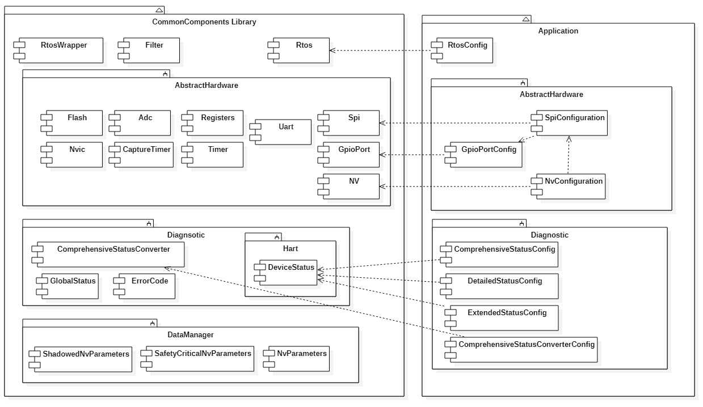
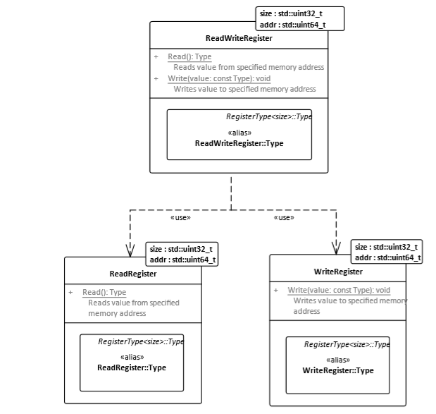
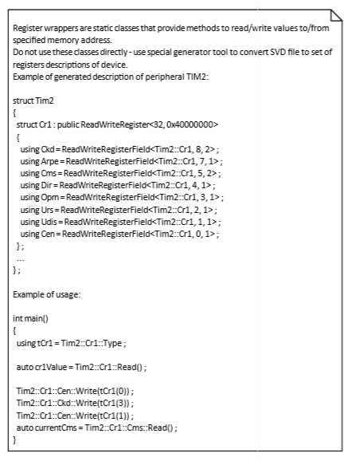

= RML approach to design

:stem:

== Common Library

Tne main idea of RMl is reuse common components in different projects:

The Common Library consists common interfaces and implementation for:

* CortexM4 Hardware modules
* Registers wrapper
* Diagnostic
* Nv parameters
* Simple Tasker (Rtos)
* Rtos wrapper for third part RTOS
* Some other specific things like Filter, Duration calculation and so on

It allows RML to use components in their applications without any modification. The application just configure the components and uses it.

Example of configuring the Hardware

[source, cpp]
----
// Filename  	: uartconfig.hpp

#pragma once

#include "system.hpp"                   // For systemClock
#include "hwuart.hpp"                   // For HwUart
#include "uart.hpp"                     // For Uart4
#include "uart4registers.hpp"           // For Uart4 registers

class tFrequencyTransmitter ; //subsriber for Uart events
using tUart =  Uart<HwUart<Uart4, System::systemClock / System::apbPrescaler>, tFrequencyTransmitter> ;
----

Example of configure the Rtos Timers:

[source, cpp]
----
// rtostimersconfig.hpp

#pragma once
#include "rtostimer.hpp"        // For RtosTimer
#include "rtostimerservice.hpp" // For RtosTimerService
#include "tasksconfig.hpp"      // For led1Task

//Timer for Led1 task
using tLed1Timer = RtosTimer<
  led1Task,
  1000U, //time in ms
  static_cast<tTaskEvents>(Led1TaskEvents::togglePin)> ;

//Timer for MeasurementDirector task
using tMeasTimer = RtosTimer<
  measTask,
  100U, //time in ms
  static_cast<tTaskEvents>(MeasurementDirectorTaskEvents::calculate)> ;

//Timer for Frequency Transmition task
using tFrequencyTransmissionTimer = RtosTimer<
  frequencyTransmissionTask,
  1000U, //time in ms
  static_cast<tTaskEvents>(FrequencyTransmissionEvents::transmitFrequency)> ;

using tRtosTimerService =
  RtosTimerService<tLed1Timer, tMeasTimer, tFrequencyTransmissionTimer> ;

----

Example of tasks configuration:

[source, cpp]
----
//Filename  	: tasksconfig.hpp

#pragma once

#include "itask.hpp"                            // For ITask
#include "rtos.hpp"                             // For Rtos
#include "testtasks.hpp"                        // For Led1Task, Led2Task
#include "measurementdirector.hpp"              // For MeasurementDirector
#include "measurementdirectorconfig.hpp"        // For SensorBoardFrequencyProcessing
#include "frequencytransmissiondirector.hpp"    // For FrequencyTransmissionDirector

//Tasks: global objects
inline Led1Task led1Task ;
inline MeasurementDirector<SensorBoardFrequencyProcessing> measTask ;
inline FrequencyTransmissionDirector frequencyTransmissionTask ;

enum class TaskPriorities : tTaskPriority
{
  lowest = 1U,
  low = 2U,
  medium = 3U,
  high = 4U,
  highest = 5U
} ;

//Configuration of Tcb block of task Led1
inline constexpr TaskControlBlock tcb1
{
  &led1Task,
  static_cast<tTaskPriority>(TaskPriorities::low)
} ;

//Configuration of Tcb block of MeasurementDirector task
inline constexpr TaskControlBlock tcb2
{
  &measTask,
  static_cast<tTaskPriority>(TaskPriorities::low)
} ;

//Configuration of Tcb block of Frequency Transmission task
inline constexpr TaskControlBlock tcb3
{
  &frequencyTransmissionTask,
  static_cast<tTaskPriority>(TaskPriorities::low)
} ;

using tRtos = Rtos<&tcb1, &tcb2, &tcb3> ;

----

And use this:
[source, cpp]
----
int main()
{
  tUart::Enable() ;
  tUart::SetBaudRate(tU32{9600U}) ;
  tUart::SetParity(UartParity::none) ;
  tUart::SetWordLength(UartWordLength::eightDataBits) ;
  tUart::SetStopBitsNumber(UartStopBits::oneBit) ;
  tUart::EnableTransmitter() ;

  //Start three tasks: frequencyTransmissionTask, measTask, led1Task
  tRtos::Start();

  return 0;

}
----

All design used static polymorphism, but it is possible to use the traditional approach with objects

== Common Library advantages

* Save a lot of efforts.
* Reduce risk of mistakes and bug
* Less manual work

Example

==== Example of subsription
All our subscriptions are performed during the creating of object in constructor. Only one case (Primary variable subscription)
is performed during the run time. All other subscribers could be known during the compiler time.
So this is an example of subscription of different tasks Timers to RtosTimer.

[source, cpp]
----

template<tU8 size>
class cRtosHwTimer
{
   public:
      virtual void isrHandler(void);
      void subscribe(cHwTimerSubscriber* pSubscriber);
      ...
   private:
      cRtosHwTimer(const cRtosHwTimer& other);
      const cRtosHwTimer& operator=(const cRtosHwTimer& other);

      static const tU8 maxSubscribersNumber;
      cHwTimerSubscriber* subscribers[size];
      tU8 subscribersNumber;
};

// Subsription
template<tU8 size>
void cRtosHwTimer<size>::subscribe(cHwTimerSubscriber* pSubscriber)
{
   ASSERT(subscribersNumber < maxSubscribersNumber); // check array lentgh
   subscribers[subscribersNumber] = pSubscriber;
   subscribersNumber++; //counter
}

template<tU8 size>
void cRtosHwTimer<size>::isrHandler(void)
{
   ...
   for(tU8 index = (tU8)0; index < subscribersNumber; index++)
   {
      subscribers[index]->timerExpiredNotify();
   }
}

//Sunsription of timers. Лишний код и работа
cRtosTimerService::cRtosTimerService(void) : ...
{
   ...

   cRtosHwTimer<TIMER_MULTIPLE_SUBSCRIBERS>& oHalfSecondTimer = oRtosHwTimerService.getTimerHalfSecond();

   oHalfSecondTimer.subscribe(&timerSensorTemperature);
   oHalfSecondTimer.subscribe(&timerTaskExecutionMonitor);
   oHalfSecondTimer.subscribe(&timerLoiDirector);
   oHalfSecondTimer.subscribe(&timerLoiDirectorMenuMode);
   oHalfSecondTimer.subscribe(&timerLoiDirectorMenuModeExitTimeout);
   oHalfSecondTimer.subscribe(&oTestFixedCurrent);
}
----

RML Common library implementation of the same things

[source, cpp]
----
template <auto& ...Timers> //for types use template <typename ...Timers>
struct TaskerTimerService {
    static void OnSystemTick()  //Timer interrupt handler
    {
        (Timers.timerExpiredNotify(), ...) ; //notify all subsribers
    }
} ;

//Subscribe timers of tasks on service of SystemTimer.
using tRtosTimerService = TaskerTimerService<timerSensorTemperature, timerTaskExecutionMonitor, timerLoiDirector, timerLoiDirectorMenuMode, timerLoiDirectorMenuModeExitTimeout> ;
----

== Register approach

RML does not used the CMSIS at all. Instead of that is used registers which are generated from *.svd files, base on the article https://habr.com/ru/post/459642/. It allows to have safe access to the registers.

And example of usage

In the beginning RML uses CMSIS and this how they works with registers:
[source, cpp]
----
GPIOA->AFR[1] = 0xBB000U ;
BitUtils::SetMask(RCC->APB1ENR,
                   RCC_APB1ENR_TIM2EN | RCC_APB1ENR_TIM3EN |
                   RCC_APB1ENR_TIM4EN | RCC_APB1ENR_UART4EN) ;
NVIC_EnableIRQ(TIM2_IRQn) ; //additional code here in the function
----

And then RML decided to use autogenerated registers from svd file:

[source, cpp]
----
Gpioa::Afrh::Afrh11::Write(11U) ;

Rcc::Apb1Enr::Tim2En::Write(RccApb1EnrTim2EnValues::clockEnabled) ;
Rcc::Apb1Enr::Tim5En::Write(RccApb1EnrTim5EnValues::clockEnabled) ;
Rcc::Apb1Enr::Uart4En::Write(RccApb1EnrUart4EnValues::clockEnabled) ;

NvicManager::EnableIrq<Irqn::tim2>() ; // no additional code at all
----

It is possible to use another approach for safety access to the registers base on  https://habr.com/ru/post/459642/:
[source, cpp]
----
 GPIOB::AFRHPack<
        GPIOB::AFRH::AFRH13::Af5,
        GPIOB::AFRH::AFRH15::Af5
    >::Set() ; // no additional code

 RCC::APB1ENRPack<
        RCC::APB1ENR::TIM4EN::Enable,
        RCC::APB1ENR::TIM2EN::Enable,
        RCC::APB1ENR::TIM3EN::Enable,
        RCC::APB1ENR::USART4EN::Enable
    >::Set() ; // no additional code

 RCC::APB1ENR::USART4EN::Disable::Set() ;

 NvicManager::EnableIrq<Irqn::tim2>() ; // no additional code
----

