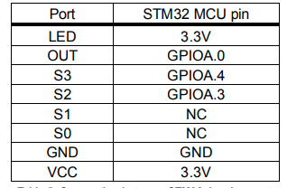

[.text-center]
Южно-Уральский государственный университет (НИУ)
Высшая школа электроники и компьютерных наук
Кафедра «Информационно-измерительная техника»

[.text-right]
УТВЕРЖДАЮ +
Заведующий кафедрой +
&#95;&#95;&#95;&#95;&#95;&#95;&#95;&#95;&#95;&#95; (А.П.Лапин) +
&#95;&#95;&#95;&#95;&#95;&#95;&#95;&#95;&#95;&#95;&#95;&#95;&#95;&#95;&#95; 2021 г.

[.text-center]
*ЗАДАНИЕ НА РАБОТУ* +
на курсовую работу
студентам: +
группа: КЭ-413

{nbsp} +
{nbsp} +
{nbsp} +

[.text-left]
1. *Дисциплина:* *_Программное обеспечение измерительных процессов._*
2. *Тема работы:* *_Разработка устройства подсчета красных объектов_*
3. *Требования к разработке:*
* Для разработки должна использоваться отладочная плата https://www.waveshare.com/product/arduino-2/boards-kits/nucleo/xnucleo-f411re.htm[XNUCLEO-F411RE]
* Устройство должно уподсчитывать количество красных объектов поднесенных к нему
** При каждом определении красного объекта, счетчик объектов должен увеличиваться на 1.
** При кратковременном нажатии на кнопку, счетчик красных объектов должен быть сброшен
** Для измеренения цвета объектов должен использоваться датчик цвета см https://www.waveshare.com/wiki/Color_Sensor
*** Скорость определения цвета должна быть не менее 100 ms: +
*** Сенсор цвета должен быть подключен по следующей схеме

*** Для измерения частоты использовать порт PA.0 и таймер TIM1 канал 1

* Перед работой устройство должено быть откалибровано
** Для запуска калибровки использовать нажатие на USER Button более чем 2 секунды

* Устройство должно передавать количество красных объектов по Bluetooth
** Период вывода информации на Bluetooth должен быть 500ms.
** формат вывода: +
"Количество красных помидоров:  XXX" +

* Архитектура должна быть представлена в виде UML диаграмм в пакете Star UML
* Приложение должно быть написано на языке С++ с использование компилятора ARM 8.40.2
* При разработке должна использоваться Операционная Система Реального Времени FreeRTOS и https://github.com/lamer0k/RtosWrapper[С++ обертка над ней]

4. *Перечень вопросов, подлежащих разработке:*
* В ходе работы необходимо разработать архитектуру программного обеспечения в виде диаграммы UML.
* В ходе работы необходимо разработать код программного обеспечения.
** Код должен соответствовать стандарту кодирования https://tproger.ru/translations/stanford-cpp-style-guide/[Стэнфордского университета], см также https://stanford.edu/class/archive/cs/cs106b/cs106b.1158/styleguide.shtml[оригинал]
* Работа программы должна быть продемонстрирована совместно с платой XNUCLEO-F411RE.
* Содержание работы должно соответствовать ГОСТ 19.402–78 «Единая система программной документации. Описание программы».
** работа должна быть оформлена в формате Asciidoc и выложена на Github
* Описание архитектуры в виде UML диаграмм должно быть оформлено в разделе «Описание логической структуры» -> “Алгоритм программы”.
* Дополнительно к архитектуре, в разделе «Описание логической структуры» -> “Структура программы с описанием функций составных частей и связи между ними” должен быть описан принцип работы программы и взаимодействия разных блоков программы друг с другом.
* Оформление пояснительной записки к курсовой работе в соответствии с СТО ЮУрГУ 04–2008 «Курсовое и дипломное проектирование. Общие требования к содержанию и оформлению».

5. *Календарный план:*
* Сдача этапов выполнения курсовой работы осуществляется строго в соответствии с календарным планом.

[cols="4,3,2"]
|===
|Наименование разделов курсовой работы |Срок выполнения разделов работы |Отметка руководителя о выполнении

|Разработка общей архитектуры программы
|28 марта 2020 г.
|

|Разработка кода каркаса программы
|4 апреля 2020 г.
|

|Разработка детальной архитектуры модуля работы с датчиком
|11 апреля 2020 г.
|

|Разработка кода для модуля работы с датчиком
|11 апреля 2020 г.
|

|Разработка детальной архитектуры модуля работы кнопкой
|18 апреля 2020 г.
|

|Разработка кода для модуля работы с кнопкой
|18 апреля 2020 г.
|

|Разработка детальной архитектуры модуля работы с USART и блутуз
|25 апреля 2020 г.
|

|Разработка кода для модуля работы  с USART и блутуз
|25 апреля 2020 г.
|

|Разработка детальной архитектуры и кода для оставшихся модулей
|2 мая 2020 г.
|

|Сдача и демонстрация работы устройства
|9 мая 2020 г.
|

|Оформление пояснительной записки к курсовой работе
|20 мая 2020 г.
|

|===

{nbsp} +
{nbsp} +

Руководитель работы:  &#160;&#160;&#160;&#160;&#160;&#160;&#160;&#160;&#160;&#160;&#160;&#160;&#160;&#160;&#160;&#160;&#160;&#160;&#160;&#95;&#95;&#95;&#95;&#95;&#95;&#95;&#95;&#95;&#95;&#95;&#95;&#95;&#95;&#95;&#95;&#95;&#95;&#95;&#95;&#95;&#95;&#95;&#95;&#95;&#95;&#95;&#95;&#95;&#95;&#95;&#95;&#95;&#95;&#95;&#95;&#95;&#95;&#95;&#95;&#95;/С. В. Колодий/ +
[.text-center]
(подпись) +

[.text-left]
Студент &#160;&#160;&#160;&#160;&#160;&#160;&#160;&#160;&#160;&#160;&#160;&#160;&#160;&#160;&#160;&#160;&#160;&#160;&#160;&#160;&#160;&#160;&#160;&#160;&#160;&#160;&#160;&#160;&#160;&#160;&#160;&#160;&#160;&#160;&#160;&#160;&#160;&#160;&#160;&#160;&#160;&#160;&#160;&#160;&#160;&#160; &#95;&#95;&#95;&#95;&#95;&#95;&#95;&#95;&#95;&#95;&#95;&#95;&#95;&#95;&#95;&#95;&#95;&#95;&#95;&#95;&#95;&#95;&#95;&#95;&#95;&#95;&#95;&#95;&#95;&#95;&#95;&#95;&#95;&#95;&#95;&#95;&#95;&#95;&#95;&#95;&#95;/&#160;&#160;&#160;&#160;&#160;&#160;&#160;&#160;&#160;&#160;&#160;&#160;&#160;&#160;&#160;&#160;&#160;&#160;&#160;&#160;&#160;&#160; / +

[.text-center]
(подпись) +

[.text-left]
Студент &#160;&#160;&#160;&#160;&#160;&#160;&#160;&#160;&#160;&#160;&#160;&#160;&#160;&#160;&#160;&#160;&#160;&#160;&#160;&#160;&#160;&#160;&#160;&#160;&#160;&#160;&#160;&#160;&#160;&#160;&#160;&#160;&#160;&#160;&#160;&#160;&#160;&#160;&#160;&#160;&#160;&#160;&#160;&#160;&#160;&#160; &#95;&#95;&#95;&#95;&#95;&#95;&#95;&#95;&#95;&#95;&#95;&#95;&#95;&#95;&#95;&#95;&#95;&#95;&#95;&#95;&#95;&#95;&#95;&#95;&#95;&#95;&#95;&#95;&#95;&#95;&#95;&#95;&#95;&#95;&#95;&#95;&#95;&#95;&#95;&#95;&#95;/&#160;&#160;&#160;&#160;&#160;&#160;&#160;&#160;&#160;&#160;&#160;&#160;&#160;&#160;&#160;&#160;&#160;&#160;&#160;&#160;&#160;&#160; / +

[.text-center]
(подпись) +

